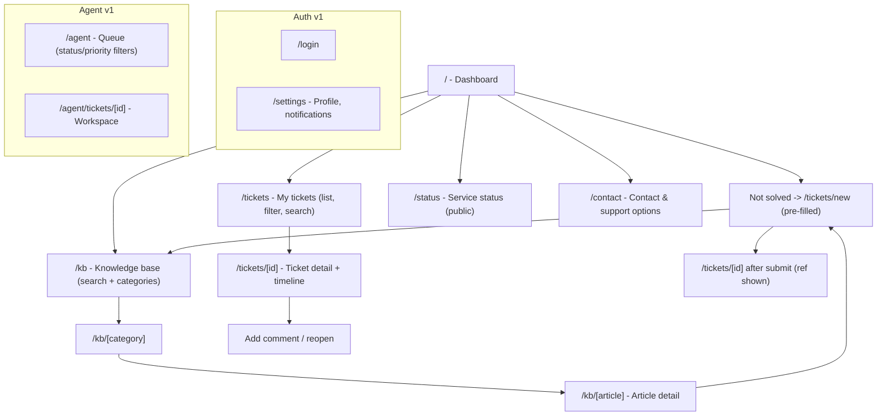
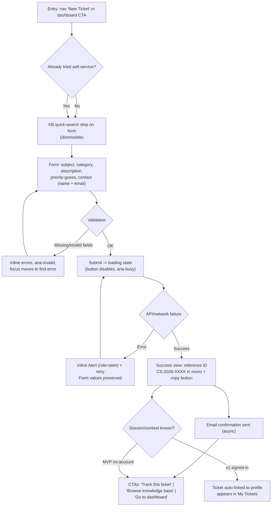
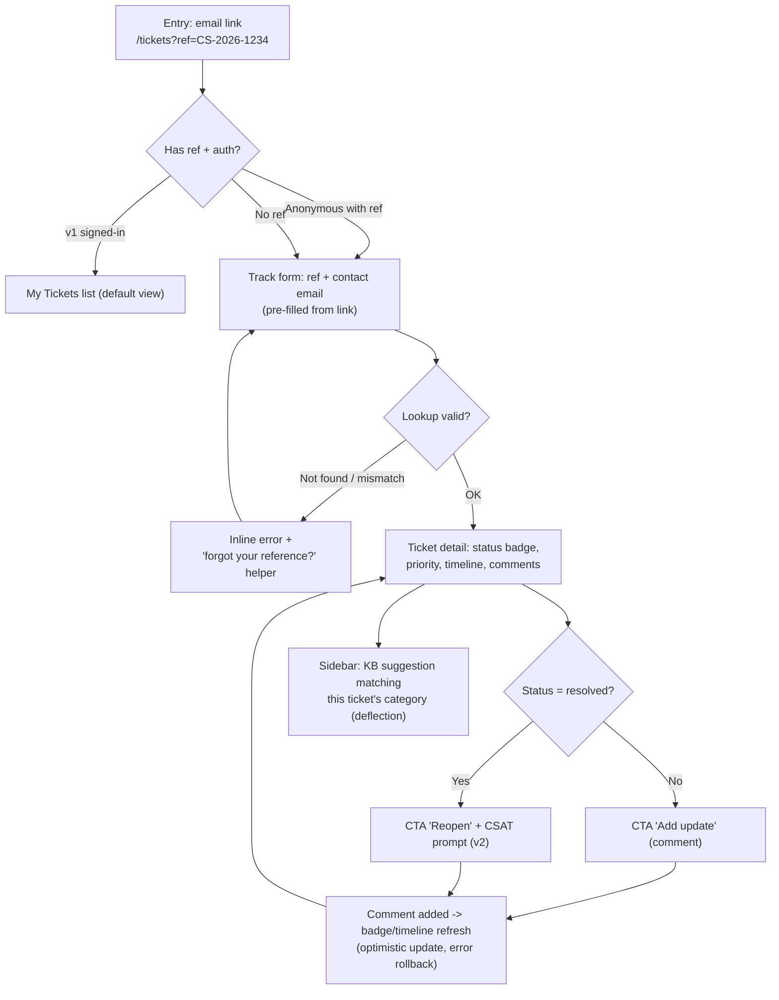
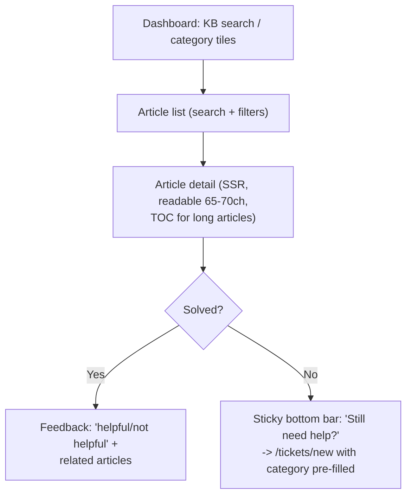

# UX Design — Customer Support Frontend

| Field | Value |
|---|---|
| Document | `docs/04-ux-design.md` |
| Status | Draft v1.0 |
| Date | 2026-08-19 |
| Author | Sofia (UX Designer) |
| Repo | `Samuel-Ricardo/customer_support_frontend` |
| Product intent | Customer support portal (see `docs/06-product-analysis.md`: MVP = ticket intake loop) |
| Scope | Current-state audit, WCAG 2.1 AA audit, IA, design system, user flows, quick wins |
| Source files audited | `src/app.tsx`, `src/app.css`, `src/components/Nav.tsx`, `src/components/Counter.tsx`, `src/routes/index.tsx`, `src/routes/about.tsx`, `src/routes/[...404].tsx`, `tailwind.config.cjs`, `package.json` |

---

## 1. Current State Audit

### 1.1 Summary

The UI is untouched SolidStart + Tailwind v3.4.3 boilerplate: a sky-blue nav, two text pages that say "Hello world!", one counter button, and a 404 page that links to solidjs.com. There is no product framing, no design system, no dark mode that actually works, two invalid CSS classes in active use, and one WCAG AA failure in light mode. The foundation (SSR, Tailwind, file-based routing) is sound; everything visual needs to be rebuilt against a token system.

### 1.2 Visual hierarchy and layout

| Finding | Evidence (verified) | Impact |
|---|---|---|
| No page-level structure beyond `<main class="text-center mx-auto text-gray-700 p-4">` | `index.tsx:6`, `about.tsx:6`, `[...404].tsx:5` | Every page is a centered text column; no layout system exists to hang a dashboard/list/detail on |
| `text-center` applied indiscriminately | all three routes | Left-aligned body text does not exist anywhere; long-form content (KB articles, ticket comments) will need it — flag for the component layer |
| Nav is a horizontal `ul` with no brand/logo slot, no actions slot | `Nav.tsx:8-16` | No place for user identity, sign-in, or search — must be redesigned before auth (v1) |
| 404 page content is boilerplate | `[...404].tsx:8-14` links to solidjs.com | Misleading in a real product; must show "ticket not found" style guidance instead |
| `container flex items-center p-3` on the nav `ul` | `Nav.tsx:9` | Works (constrains content, centers), but `container` is applied to the list, not the bar — acceptable, yet fragile; move to a layout component |
| Fixed arbitrary widths on the counter button | `Counter.tsx:7` `w-[200px]` | Text "Clicks: 10000" would clip under large text settings; button widths must be content-driven |

### 1.3 Typography

| Finding | Evidence | Verdict |
|---|---|---|
| `font-thin` (100) + `uppercase` + `text-6xl` on every h1 | `index.tsx:7`, `about.tsx:7`, `[...404].tsx:6` | Inconsistent with a support product (voice: clear, calm, helpful). Weight 100 renders poorly on some Windows stacks even at 60px; uppercase degrades readability of long titles (real ticket subjects will not fit this pattern) |
| No type scale, no line-height or letter-spacing tokens | all files | Tailwind defaults only; h1 is the only sized element |
| Body text relies on inherited defaults (16px) | `app.css` | Acceptable, but no explicit scale = drift once real content arrives |
| Invalid class `max-6-xs` on all h1s | `index.tsx:7` | **Not a real Tailwind class** (the max-width utility is `max-w-*`, e.g. `max-w-6xl` or `max-w-xs`). Tailwind v3 JIT silently drops unknown classes — no build error, no max-width applied, layout depends on the parent `p-4`. Likely intended `max-w-6xl` (paired with `text-6xl`) |

### 1.4 Colors and dark mode — broken

- `app.css:5-15` defines `--background-rgb` and `--foreground-rgb` with a `prefers-color-scheme: dark` media override; `body` consumes them (`app.css:17-19`).
- **No component class references these variables.** Every Tailwind color is hardcoded: `bg-sky-800` (nav), `text-gray-200` (nav), `text-sky-700` (h1), `text-sky-600` (links), `text-gray-700` (body), `bg-gray-100`/`border-gray-300` (counter).
- Result: in dark mode the body background turns black and body text turns white (from the vars), but the nav stays `sky-800` with `gray-200` text and page text stays `gray-700`. Measured impact below.

### 1.5 Verified contrast measurements (WCAG relative-luminance formula)

Computed with the WCAG 2.x formula (`L1+0.05)/(L2+0.05)`) for every pairing currently shipped and every pairing proposed in Section 4.

**Current UI in light mode** (background `#D6DBDC` from `--background-rgb: 214, 219, 220`):

| Pair | Ratio | WCAG 2.1 AA verdict |
|---|---|---|
| `text-gray-700 #374151` on `#D6DBDC` (body) | 7.37:1 | Pass (even AAA) |
| `text-gray-200 #E5E7EB` on `bg-sky-800 #075985` (nav links) | 6.11:1 | Pass |
| `text-sky-700 #0369A1` on `#D6DBDC` (h1) | 4.25:1 | Pass for large text (3:1), fail for normal text (4.5:1) |
| **`text-sky-600 #0284C7` on `#D6DBDC` (body links)** | **2.93:1** | **FAIL — normal and large text** |
| `text-gray-400 #9CA3AF` on `bg-gray-100 #F3F4F6` (counter focus border) | 2.31:1 | FAIL — focus indicator needs ~3:1 vs adjacent colors |
| `border-sky-600 #0284C7` on `bg-sky-800 #075985` (active nav indicator) | 1.85:1 | FAIL — visually indistinguishable as "active" |

**Current UI with dark mode active** (`prefers-color-scheme: dark` → bg black):

| Pair | Ratio | Verdict |
|---|---|---|
| **`text-gray-700 #374151` on black (body text)** | **2.04:1** | **FAIL — severe; body copy unreadable** |
| `text-sky-700 #0369A1` on black (h1) | 3.54:1 | Pass large text only |
| `text-sky-600 #0284C7` on black (links) | 5.13:1 | Pass (ironically the only pass) |
| `bg-sky-800` nav on black page | — | Bar blends into a black page (both dark); loses visual separation |

**Proposed design system pairs (Section 4), all verified:**

| Pair | Ratio | Verdict |
|---|---|---|
| `sky-700 #0369A1` on white (text links) | 5.93:1 | AA pass |
| `blue-600 #2563EB` on white (primary actions) | 5.17:1 | AA pass |
| white on `blue-700 #1D4ED8` (primary button) | 6.70:1 | AA pass |
| `slate-700 #334155` on white (body) | 10.35:1 | AAA pass |
| `slate-500 #64748B` on white (secondary text) | 4.76:1 | AA pass |
| `blue-800 #1E40AF` on `blue-50 #EFF6FF` (badge: open) | 8.01:1 | AA pass |
| `green-800 #166534` on `green-50 #F0FDF4` (badge: resolved) | 6.81:1 | AA pass |
| `amber-800 #92400E` on `amber-50 #FFFBEB` (badge: awaiting) | 6.84:1 | AA pass |
| `red-800 #991B1B` on `red-50 #FEF2F2` (badge: escalated) | 7.60:1 | AA pass |
| `sky-700 #0369A1` on `sky-50 #F0F9FF` (selected nav) | 5.57:1 | AA pass |

### 1.6 Navigation behavior

| Finding | Evidence | Impact |
|---|---|---|
| Plain `<a href>` for internal routes | `Nav.tsx:11,14` | Full document loads on every nav click: SSR re-render, no client-side transitions, visible flash; `@solidjs/router`'s `<A>` exists for this |
| Active state computed by exact string equality | `Nav.tsx:5` `path == location.pathname` | Will break as soon as nested routes exist (`/tickets/123` will never match `"/tickets"`); also misses trailing-slash variants |
| Active indicator is color-only (`border-sky-600` vs `border-transparent`) | `Nav.tsx:6` | Violates WCAG 1.4.1 (Use of Color): color is the sole differentiator, and at 1.85:1 it is also nearly invisible |
| No `aria-current="page"` on the active link | `Nav.tsx:10-15` | Screen reader users get no "current page" announcement |
| Hover affordance is border-color-only on transparent borders | `Nav.tsx:6` `hover:border-sky-600` | Weak; text color does not change; no underline pattern |

### 1.7 Issue register (all verified)

| # | Severity | Issue | File:line | Fix target |
|---|---|---|---|---|
| 1 | **High** | Dark mode produces 2.04:1 body-text contrast | `app.css:10-15` + hardcoded classes | Delete vars or adopt token strategy (Section 4.5) |
| 2 | **High** | Links `sky-600` at 2.93:1 fail WCAG AA | `index.tsx:11`, `about.tsx:11`, `[...404].tsx:9` | Use `sky-700` for text links |
| 3 | **High** | Invalid class `max-6-xs` (silently dropped) | `index.tsx:7`, `about.tsx:7`, `[...404].tsx:6` | Replace with real utility (`max-w-6xl`) or remove |
| 4 | **Medium** | Active nav indicator 1.85:1 + color-only | `Nav.tsx:6,10-15` | Add `aria-current="page"`, stronger indicator (underline + weight + text color) |
| 5 | **Medium** | Internal nav uses `<a>` not `<A>` | `Nav.tsx:11,14` | Switch to `@solidjs/router` `<A>` |
| 6 | **Medium** | No visible focus treatment on any interactive element except weak 2.31:1 counter border | `Counter.tsx:7` | Global `focus-visible` ring token (Section 4.6) |
| 7 | **Medium** | No skip link; `<main>` has no `id` | `app.tsx:12-14` | Add skip link + `id="main"` |
| 8 | **Medium** | No `aria-current`, no nav landmark label needed (single landmark), but no brand/identity slot | `Nav.tsx` | Redesign shell (Section 4.6) |
| 9 | **Medium** | No per-route `<title>`/meta; SSR SEO opportunity unused | routes | Route-level `title`/meta (SolidStart `document` or head utils) |
| 10 | **Low** | `font-thin` + `uppercase` 6xl h1; tone mismatch with product voice | routes `h1`s | Type scale tokens (Section 4.3); sentence-case headings |
| 11 | **Low** | 404 page references solidjs.com; content is boilerplate | `[...404].tsx:8-14` | Product 404: "Ticket not found" guidance + links |
| 12 | **Low** | No loading, empty, or error states anywhere (static demo only) | all routes | Component states (Section 4.6) |
| 13 | **Low** | `container` applied to nav `ul` rather than a layout wrapper | `Nav.tsx:9` | Move to AppShell layout component |
| 14 | **Low** | Fixed `w-[200px]` button; arbitrary values instead of scale | `Counter.tsx:7` | Buttons sized by content; use spacing/radius tokens |
| 15 | **Low** | `main` lacks `lang` concern + page titles; favicon is the only asset (`public/favicon.ico`) | `app.tsx`, `public/` | Verify `<Html lang>`, add meta description; assets task in E1 |

---

## 2. Accessibility Audit (WCAG 2.1 AA)

### 2.1 Conformance checklist (current state)

| WCAG 2.1 criterion | Verdict | Evidence | Remediation |
|---|---|---|---|
| 1.1.1 Non-text content | Pass (no meaningful images) | — | Maintain with alt/aria on future icons |
| 1.3.1 Info and relationships | Partial | `nav`/`main` landmarks correct; lists correct | Heading order is a single `h1` per page — keep; add `aria-current`; label form fields |
| 1.4.1 Use of color | **Fail** | Active nav indicator is color-only | Indicator = color + weight + underline; status badges pair color with text/icon |
| 1.4.3 Contrast (minimum) | **Fail** | `sky-600` links 2.93:1; dark mode body 2.04:1; h1 4.25:1 (large-text pass only) | Token pairs in Section 1.5 table |
| 1.4.4 Resize text | Partial | No fixed-`px` fonts found; `w-[200px]` button risks clipping at 200% zoom | Content-driven widths, fluid layout |
| 1.4.10/1.4.11 Reflow / Non-text contrast | Partial | `w-[200px]` + `text-6xl` h1 risk horizontal overflow; focus border 2.31:1 | Breakpoints (Section 4.7); focus ring token with 3:1 |
| 2.1.1 Keyboard | Pass (all elements are native `a`/`button`) | — | Keep native elements; no custom widgets yet |
| 2.4.1 Bypass blocks | **Fail** | No skip link; every page starts with nav | Skip link as first focusable element → `#main` |
| 2.4.4 Link purpose | Partial | solidjs.com links meaningful but product-irrelevant | Replace with product links |
| 2.4.6 Headings and labels | Partial | Single h1 per page (good); no labels exist yet (no forms) | Forms: `<label for>` on every field |
| 2.4.7 Focus visible | **Fail** | Counter `focus:border-gray-400` 2.31:1; links rely on UA default | Global `:focus-visible` ring: 2px, 3:1 contrast, 2px offset |
| 3.2.3 Consistent navigation | Pass (nav is global) | `app.tsx:12` | Keep single nav instance in root |
| 3.3.1/3.3.2 Error identification | N/A (no forms) | — | Design form error pattern: inline message + `aria-describedby` + `aria-invalid` (Section 5.1) |
| 4.1.2 Name, role, value | Partial | Native elements OK; `aria-current="page"` missing | Add to active nav link |

### 2.2 Keyboard walkthrough (target behavior)

```
Tab order (target):
  1. Skip link (visible on focus)        -> jumps to #main
  2. Nav links (Home, My Tickets, New Ticket, Knowledge Base, Contact)
     + aria-current="page" on active
  3. Page content: h1 -> actions -> form fields (labeled) -> buttons
  4. Every interactive element shows a 2px ring at >= 3:1 contrast
```

Current behavior differs: no skip link, no `aria-current`, focus indication
unreliable on nav, weak on the counter button.

### 2.3 Prioritized accessibility fixes

| Priority | Fix | Criterion |
|---|---|---|
| P0 | Swap link colors to AA pairs; delete broken dark mode | 1.4.3 |
| P0 | Skip link + `id="main"` | 2.4.1 |
| P0 | Global `:focus-visible` ring | 2.4.7, 1.4.11 |
| P1 | `aria-current="page"` + robust active indicator | 1.4.1, 4.1.2 |
| P1 | Route titles/meta (SSR) | 2.4.2 (Page titled) |
| P1 | Status badges = color + text/icon | 1.4.1 |
| P2 | Form error patterns, announcements (`aria-live` for async state) | 3.3.x, 4.1.3 |
| P2 | Automated checks: `@axe-core`/Cypress a11y assertions in CI | ongoing |

---

## 3. Information Architecture — Customer Support Product

### 3.1 Personas and jobs (from `06-product-analysis.md`, abbreviated)

| Persona | Primary jobs | IA implication |
|---|---|---|
| End customer | Submit a ticket fast; know what happens next; check status without calling | Dashboard + New Ticket + My Tickets must be reachable in ≤ 2 clicks |
| Support agent | Prioritize queue; triage with context; close tickets | Agent workspace is a separate top-level area (`/agent/*`), not mixed with customer content |
| Support manager | SLA, volume, CSAT | Analytics lives in agent area (v2) |
| Anonymous visitor | Self-serve (KB), find contact info, check service status | Public routes: KB, status page, contact |

### 3.2 IA principles

1. **Two customer paths, never mixed**: "I want help now" (create ticket/contact) vs "I want to track/understand" (my tickets, KB, status). Both paths start from the dashboard.
2. **Create ticket is one primary action**, visually dominant on the dashboard and in the nav; never more than two clicks from anywhere.
3. **Reference-ID lookup before accounts**: MVP (per product analysis) has no auth — the tracking path must work from an email link (`/tickets?ref=CS-1234` + contact) as well as from "My Tickets".
4. **Knowledge base deflects tickets**: KB is findable from the dashboard and from the "didn't find an answer" moment in the ticket form.
5. **Progressive disclosure**: dashboard shows summary + next best action; detail views carry the full state and history.

### 3.3 Sitemap



### 3.4 Route map (SolidStart file routes)

```text
src/routes/
  index.tsx              # dashboard (public summary + actions)
  tickets.tsx            # my tickets: list + lookup by reference
  tickets/new.tsx        # create ticket form
  tickets/[id].tsx       # ticket detail + timeline
  kb.tsx                 # KB home: search, categories
  kb/[category].tsx      # article listing
  kb/[article].tsx       # article detail (SSR-rendered for SEO)
  contact.tsx            # contact/support options, fallback
  status.tsx             # service status (v1)
  login.tsx              # (v1)
  settings.tsx           # profile + notifications (v1)
  agent/index.tsx        # queue (v1)
  agent/tickets/[id].tsx # agent workspace (v1)
  [...404].tsx           # product 404
```

Shared layout: `app.tsx` gains AppShell (header nav + `main id="main"` + skip link + footer). Ticket/agent areas may register their own nested layouts later.

### 3.5 Navigation model

| Area | Who | Nav pattern |
|---|---|---|
| Public (MVP) | Anonymous customers | Top bar: brand, New Ticket (primary), My Tickets, KB, Contact; right side: Track a ticket (reference lookup) |
| Customer (v1 auth) | Signed-in customers | Same top bar + profile menu; dashboard shows "my open tickets" |
| Agent (v1) | Agents | Separate `#/agent` shell: queue, workspace, analytics; top bar shows role switch out |

Dashboard content (MVP): greeting-less utility grid — headline CTA "Create a support ticket", reference-ID lookup ("Track an existing ticket"), KB search, service status chip, recent tickets of this contact (if any). Left-aligned, trust-first copy.

---

## 4. Design System Proposal

### 4.1 Principles (Fluent-aligned, adapted to Tailwind)

1. **Calm and competent** — customers are here because something is wrong. Low visual noise, generous whitespace, one primary action per screen.
2. **Accessible by default** — every token pair ships with a verified ≥ 4.5:1 ratio (Section 1.5 table); focus ring is part of tokens, not an afterthought.
3. **Predictable states** — every component defines default / hover / focus-visible / disabled / loading / error / empty.
4. **Light + depth** — elevation via shadows, not borders; motion 150–250 ms, easing `cubic-bezier(0.2, 0, 0, 1)` (Fluent), honoring `prefers-reduced-motion`.

### 4.2 Color tokens

Semantic naming (surfaces, text, actions) plus functional status tokens. All computed pairs verified in Section 1.5.

```css
/* tailwind theme extension (values shown; classes generated by Tailwind) */
:root {
  /* surfaces */
  --color-surface: 255 255 255;        /* bg-surface -> white */
  --color-surface-muted: 248 250 252;  /* slate-50 */
  --color-surface-inverse: 15 23 42;   /* slate-900 (dark nav/brand bar) */
  /* text */
  --color-text-primary: 51 65 85;      /* slate-700  -> 10.35:1 on white */
  --color-text-secondary: 100 116 139; /* slate-500  -> 4.76:1 on white */
  --color-text-inverse: 226 232 240;   /* slate-200 */
  /* brand / actions */
  --color-brand: 37 99 235;            /* blue-600   -> 5.17:1 on white (primary) */
  --color-brand-hover: 29 78 216;      /* blue-700   -> white on it: 6.70:1 */
  --color-brand-link: 3 105 161;       /* sky-700    -> 5.93:1 on white (text links) */
  --color-brand-soft: 239 246 255;     /* blue-50    (selected nav pill) */
  /* status (badge pairs: 800-level text on 50-level bg, all >= 6.8:1) */
  --color-status-open-fg: 30 64 175;   --color-status-open-bg: 239 246 255;    /* blue-800/-50   */
  --color-status-progress-fg: 146 64 14; --color-status-progress-bg: 255 251 235; /* amber-800/-50 */
  --color-status-resolved-fg: 22 101 52; --color-status-resolved-bg: 240 253 244; /* green-800/-50 */
  --color-status-escalated-fg: 153 27 27; --color-status-escalated-bg: 254 242 242; /* red-800/-50  */
  /* feedback */
  --color-danger: 220 38 38;           /* red-600 (destructive actions) */
  --color-danger-soft: 254 242 242;    /* red-50   */
  --color-focus-ring: 2 132 199;       /* sky-600  2px ring, >= 3:1 on surfaces */
}
```

Rules: text links use `brand-link` (`sky-700`, 5.93:1) — **never** `sky-600` as body text; `sky-600` is reserved for icons at large sizes and focus rings; primary buttons are `blue-700` with white text; status is always color **plus** text (not color alone).

### 4.3 Typography scale

| Token | Class | Size / weight / case | Use |
|---|---|---|---|
| display | `text-4xl font-semibold tracking-tight text-slate-900` | 36px / 600 / sentence | Dashboard page titles |
| heading-1 | `text-3xl font-semibold tracking-tight` | 30px / 600 / sentence | Page titles (ticket detail, KB) |
| heading-2 | `text-xl font-semibold` | 20px / 600 | Section titles |
| heading-3 | `text-base font-semibold` | 16px / 600 | Card titles |
| body | `text-base text-slate-700` | 16px / 400 | Default |
| body-small | `text-sm text-slate-500` | 14px / 400 | Metadata, timestamps |
| label | `text-sm font-medium` | 14px / 500 | Form labels, table headers |
| mono | `font-mono text-sm` | 14px | Ticket reference IDs (CS-1234) |

Sentence case everywhere (no `uppercase` headings). `font-thin` retired.

### 4.4 Spacing, radius, shadow, motion

| Token | Value | Notes |
|---|---|---|
| Space scale | 4px base: `p-1` … `p-16` (`0.25rem`–`4rem`) | Standard Tailwind scale, no flat `3px` outliers |
| Page gutter | `px-4 sm:px-6 lg:px-8` | Aligns with current `mx-1.5 sm:mx-6` intent |
| Card padding | `p-4 sm:p-6` | |
| Radius | `rounded-md` (6px) controls/inputs; `rounded-lg` (8px) cards; `rounded-full` badges, avatars | |
| Shadow | `shadow-sm` cards resting; `shadow-lg` modals/dropdowns; `shadow-md` hover lift | Elevation = depth (Fluent light) |
| Border | `border slate-200` on cards; `border-slate-300` inputs; 2px `brand` on focus | |
| Focus ring | `focus-visible:outline-none focus-visible:ring-2 focus-visible:ring-sky-600 focus-visible:ring-offset-2` | ≥ 3:1 ring vs adjacent; offset avoids clipping |
| Motion | 150 ms (hover), 200 ms (expand/fade), 250 ms (drawer/overlay); `transition` with `cubic-bezier(0.2, 0, 0, 1)`; wrap in `@media (prefers-reduced-motion: reduce)` → disable | |
| Touch targets | ≥ 44 × 44 px hit area on mobile (48 preferred); nav links get `py-2` padding | |

### 4.5 Dark mode strategy — class strategy, not media shorthand

**Decision: `darkMode: "class"`.** Rationale:

1. The current CSS-var + media approach is broken (Section 1.4): halves of the UI follow the media query, halves hardcode colors.
2. A support portal will need a user-facing theme toggle (customers read long threads at night); class strategy allows an inline pre-hydration script that honors localStorage and falls back to `prefers-color-scheme` without FOUC — impossible with pure media queries.
3. SSR safety: SolidStart renders the initial HTML server-side; an inline script in `<head>` sets `document.documentElement.classList` before paint. Document the pattern:

```html
<!-- head: before-first-paint script (pattern only, adapt to SolidStart head API) -->
<script>
  (function () {
    var stored = null;
    try { stored = localStorage.getItem("theme"); } catch (e) {}
    var dark = stored === "dark" || (!stored && window.matchMedia("(prefers-color-scheme: dark)").matches);
    document.documentElement.classList.toggle("dark", dark);
  })();
</script>
```

```js
// tailwind.config.cjs — target shape (v3.4, current project)
module.exports = {
  darkMode: "class",
  content: ["./src/**/*.{html,js,jsx,ts,tsx}"],
  theme: {
    extend: {
      colors: {
        surface: "rgb(var(--color-surface) / <alpha-value>)",
        // ...remaining tokens from Section 4.2
      },
    },
  },
  // plugins: []
};
```

With `darkMode: "class"`, every component writes `bg-surface dark:bg-slate-950`, `text-slate-700 dark:text-slate-200`, etc. The old `--background-rgb`/`--foreground-rgb` vars and the `prefers-color-scheme` block in `app.css` are removed (or repurposed as token sources). Dark surfaces: `slate-950` background, `slate-800/900` cards, `slate-200/300` text, same functional status pairs re-checked against dark surfaces during implementation (aim ≥ 4.5:1).

### 4.6 Component inventory

| Component | Purpose | States (all: default, hover, focus-visible, disabled) | A11y notes |
|---|---|---|---|
| `AppShell` (layout) | Brand bar + nav + `main id="main"` + footer + skip link | — | Skip link first in DOM, visible on focus |
| `NavLink` | `.active` aware router link (`useLocation`), `aria-current="page"` | default / hover / active / focus | Indicator = underline + text weight + color; never color alone |
| `Button` | Variants: `primary` (blue-700), `secondary` (outline), `ghost`, `danger`; sizes `sm/md/lg` | default / hover / focus / disabled / `loading` (spinner, keeps width) | Native `<button>`; disabled styled but still distinguishable; loading announces via `aria-busy` |
| `Input`, `Textarea`, `Select`, `Field` | Form controls with label + hint + error | default / focus / error (`aria-invalid`, `aria-describedby`) / disabled | `<label for>` always; error message inline, not placeholder |
| `SearchInput` | KB search, ticket list filter | default / focus / clearable | 44 px height; announced results count (`aria-live="polite"`) |
| `StatusBadge` | Ticket status pill | static | Text + optional icon; token pairs ≥ 6.8:1 |
| `PriorityBadge` | P1–P4 | static | Same rule as StatusBadge |
| `TicketCard` | List item: ref id (mono), subject, status, priority, updated at, excerpt | default / hover (lift) / focus | `<article>` with heading; whole-card link pattern with visible focus |
| `TicketList` | Grouped list with filter bar + sort + pagination | loading (`Skeleton` rows), empty (`EmptyState`), error (`Alert` + retry) | Empty state always actionable (CTA to create ticket) |
| `Timeline` | Ticket detail: status events + comments, newest-last | — | `<ol>`; each entry has time via `<time datetime>` |
| `CommentBox` | Add comment / reopen | idle / sending / error | User-facing forms label siblings properly |
| `EmptyState` | No results, no tickets | — | Icon + title + body + primary CTA |
| `Skeleton` | Loading placeholders | — | `aria-hidden`, never blocks focus |
| `Alert` | Inline success / warning / danger | — | `role="status"` (success) / `role="alert"` (error) |
| `Toast` | Transient feedback (ticket created) | — | `role="status"`, auto-dismiss ≥ 5 s, not for errors |
| `Modal`, `Drawer` | Confirm destructive, ticket lookup, mobile filters | open / closed (focus trapped) | Focus trap, Esc closes, focus returns to trigger |
| `Breadcrumbs` | KB, ticket sub-pages | — | `nav aria-label="Breadcrumb"` + `aria-current="page"` |
| `Tabs` | KB categories, ticket filter views | — | ARIA tabs pattern or native buttons with `aria-selected` |
| `Avatar` | Agent/customer identity (v1) | — | `alt` name + initials fallback |
| `ErrorBoundary`-aware route fallback | SSR errors, API down | — | Product copy + retry + contact link |

Component contract: every component owns its a11y defaults (labels, roles, focus management) so pages cannot accidentally drop them.

### 4.7 Responsive behavior

| Breakpoint | Nav | Lists | Ticket detail | Forms |
|---|---|---|---|---|
| `< 640` (mobile) | Collapse to: brand + primary "New ticket" + menu (drawer); bottom-safe | Cards stack; filters collapse behind `Tabs`/`Filters` button | Timeline full-bleed; sidebar (meta) below thread | Single column; CTAs full width |
| `sm` 640 | Full nav row (brand, links, actions) | Cards in 1-col with 12–16px gap | Two-column: thread (main) + meta card (aside) from `lg` | Single column, max-w-xl |
| `md` 768 | Nav row; search in bar | 1-col | — | — |
| `lg` 1024 | Nav row; user menu | 1-col, max-w-4xl centered | Sidebar appears | Field grid (subject + category) side by side |
| `xl` 1280+ | — | Keep max-w-5xl (readability > width) | — | — |

Rules: content max-width ~`max-w-5xl` bag; form fields never wider than ~560 px for readability; touch targets 44 px+ below `lg`; text resizes to 200% without horizontal scroll (test at 320 px viewport + 200% zoom).

---

## 5. User Flows

### 5.1 Ticket creation flow (MVP — anonymous customer)



Edge cases handled: validation failures (inline, focus first error), network failure (alert + retry, **values preserved**, no data loss), double-submit (disabled button), success ambiguity (transition to ticket detail page rather than silent success toast).

### 5.2 Ticket tracking flow (MVP — reference lookup + status)



Edge cases: stale email links (lookup fails gracefully with help), reference typos (mono font + copy affordance on success view), status transitions mid-view (re-fetch/polling on focus), comment failure (inline error, text preserved).

### 5.3 KB deflection flow (supports 1.4.2 IA principle)



---

## 6. Quick Wins and Sequencing

Mapped to epic E1 (product foundation) of `docs/06-product-analysis.md`; each item is independently shippable.

| Priority | Change | Effort | Files touched (future) |
|---|---|---|---|
| P0 | Delete broken dark-mode vars OR token-ize (Section 4.5); fix link color to `sky-700` | 0.5 d | `app.css`, pages |
| P0 | Skip link + `id="main"` in AppShell | 0.5 d | `app.tsx` (new `AppShell`) |
| P0 | Replace `max-6-xs` with real utility; retire `font-thin uppercase` h1s | 0.25 d | routes |
| P0 | Swap nav to `<A>` + `aria-current="page"` + robust active style | 0.5 d | `Nav.tsx` |
| P1 | Global focus-visible ring (tokenize in `@layer base`) | 0.25 d | `app.css` |
| P1 | Route titles/meta (SSR) | 0.5 d | routes, head utils |
| P1 | Token files: colors, type scale, radius/shadow/motion (Section 4.2–4.4) | 1 d | `tailwind.config.cjs`, `app.css` |
| P1 | Core components: `Button`, `Input`/`Field`, `StatusBadge`, `TicketCard`, `EmptyState`, `Skeleton`, `Alert` (Section 4.6) | 3–4 d | `src/components/ui/*` |
| P1 | Skeleton IA routes (`/tickets`, `/tickets/new`, `/tickets/[id]`, `/kb`, `/kb/[category]`, `/kb/[article]`, `/contact`, `/status`) with AppShell | 1–2 d | `src/routes/*` |
| P2 | Ticket create/track flows with mock API adapter + all states | 4–5 d | flows in Section 5 |
| P2 | `prefers-reduced-motion` handling; touch-target pass; 200% zoom check | 0.5 d | global |
| P2 | a11y assertions in Cypress (axe-core) + contrast check in CI | 1 d | test suite |

**Definition of ready for any new screen:** tokenized styles (no raw hex outside tokens), AA pairs only, focus-visible everywhere, skip link honored, empty/loading/error states defined, keyboard walkthrough clean, 200% zoom clean.

---

## 7. References

- WCAG 2.1 AA — criteria cited inline (1.4.1, 1.4.3, 1.4.11, 2.4.1, 2.4.7, 3.3.x).
- Contrast ratios computed with the WCAG relative-luminance formula; all numeric claims verified on 2026-08-19 against Tailwind v3.4 palette values.
- Product context: `docs/06-product-analysis.md` (Maria, 2026-08-19) — personas, roadmap, MVP scope.
- Microsoft Fluent Design System — motion/elevation guidance referenced in Section 4.1.

---

*Produced by Sofia (UX Designer) — grounded in verified repo evidence (source files, configs) and computed WCAG contrast values as of 2026-08-19. No source files were modified.*