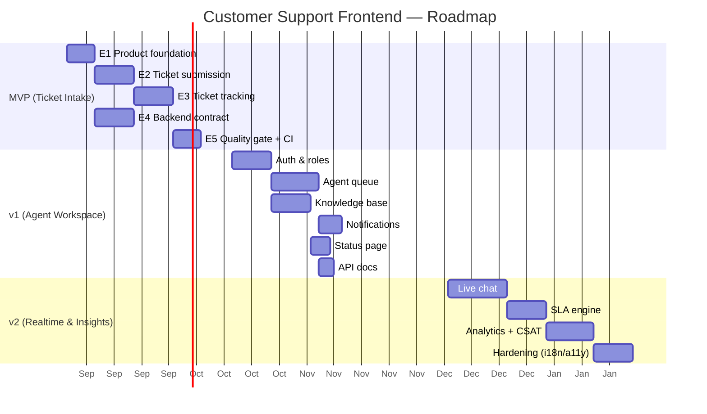

# Product Analysis — Customer Support Frontend

| Field | Value |
|---|---|
| Document | `docs/06-product-analysis.md` |
| Status | Draft v1.0 |
| Date | 2026-08-19 |
| Author | Maria (Business Analyst) |
| Repo | `Samuel-Ricardo/customer_support_frontend` |
| Branch analyzed | `develop` (21 commits) |

---

## 1. Project Intent

### 1.1 What the name implies

"Customer support frontend" is the productized form of a helpdesk/support desk web application. The repo name and scaffolded scripts encode a clear product direction:

| Signal | Evidence (verified) | Implication |
|---|---|---|
| Repo name | `customer_support_frontend` | A customer-facing support portal, not a generic SaaS shell |
| `db:sync` script | `prisma generate && prisma db push` | Own backend/database is planned (Prisma), frontend is one slice of a fuller system |
| `docs::swagger` script | `node ./swagger.js` (file missing) | API documentation/contract is planned |
| Docker + compose | `Dockerfile`, `docker-compose.yaml` (port 3000) | Self-hostable deployment target |
| SolidStart SSR | `@solidjs/start@1.0.6`, `vinxi` build | SEO/public content matters (knowledge base, status pages, public ticket tracking) |
| Jest + Cypress | `jest@29`, `cypress@13` | Quality gates are intended from day one |
| Avanade author context | Owner is an Avanade employee (Recife/PE) | Likely a portfolio piece, internal prototype, or client PoC with real product ambitions |

**Product statement (proposed):** a self-hostable customer support portal where end customers submit and track support tickets, and support agents triage, assign, and resolve them — with public content (knowledge base, status) and, over time, real-time channels (live chat) and operational analytics.

### 1.2 Target users

| Persona | Role | Core need |
|---|---|---|
| End customer | Files and tracks issues | Fast, low-friction submission; status visibility; self-service answers |
| Support agent | Works the queue | Prioritized queue, ticket context, status transitions, resolution workflow |
| Support manager | Owns service quality | SLA compliance, CSAT, volume and response-time visibility |
| Product owner (Avanade) | Owns vision/prioritization | Demoable value, credible architecture, clean roadmap |
| Engineering (dev + QA) | Builds and maintains | Testable, linted, containerized, documented codebase |

### 1.3 Typical feature set (target domain)

| Area | Features |
|---|---|
| Tickets | Submission form, reference/tracking ID, status lifecycle (open → in-progress → resolved → closed), comments, priority, category, attachments |
| Self-service | Knowledge base (articles, categories, search), FAQ, public status page |
| Agent workspace | Queue views, assignment, SLA timers, canned responses, resolution notes |
| Realtime | Live chat widget, chat transcripts, presence |
| Operations | SLA policies, escalation, analytics dashboard, CSAT surveys |
| Platform | Auth + roles (customer/agent/admin), email notifications, audit log, API docs (Swagger) |

---

## 2. Current State vs Target (Gap Analysis)

### 2.1 Evidence of current state

| Artifact | Current state (verified) | Product-ready state |
|---|---|---|
| `src/routes/` | `index.tsx` (Counter demo), `about.tsx`, `[404].tsx` | Ticket routes, KB routes, agent routes |
| `src/components/` | `Nav.tsx`, `Counter.tsx` (boilerplate) | Domain components (ticket form, status badge, chat widget) |
| `package.json` name | `"example-with-tailwindcss"` (untouched boilerplate) | Real package name + version |
| `README.md` | Default SolidStart boilerplate | Product README, setup, architecture, docs index |
| Tests | None (`jest --passWithNoTests`), zero spec files | Unit + component + E2E suites |
| CI | `code:ci` script only — no pipeline file | GitHub Actions: lint → test → build → Docker |
| Backend | No Prisma dependency (despite `db:sync`), no API client, no `swagger.js` | Data model, API contract, mock/real client |
| Deployment | 2-stage Dockerfile + compose (single frontend service) | Full stack compose, env config, health checks |

**Dead ends found in scripts** (must be fixed before they are "counted"):

| Script | Problem |
|---|---|
| `db:sync` | Calls `prisma` but **Prisma is not in dependencies** → fails today |
| `docs::swagger` | Calls `./swagger.js` → **file does not exist** |
| `test:docker` | Chains `test:dev` (jest `--watchAll`) → **hangs** in Docker/CI |
| `build:docker` | Runs `test` which is `--passWithNoTests` → builds pass with zero coverage |

### 2.2 Maturity assessment (1–5)

| Dimension | Score | Evidence | Notes |
|---|---|---|---|
| Functionality | 1 / 5 | Counter demo only; zero domain features | Everything to build |
| UX / Design | 1 / 5 | Tailwind scaffold, no design system, no layout/routes | Boilerplate-only |
| Code quality | 2 / 5 | ESLint, Prettier, Husky, tsconfig configured | Tooling ready, no domain code yet |
| Testing | 1 / 5 | Jest + Cypress installed; **zero tests** | `--passWithNoTests` hides emptiness |
| Infrastructure | 2 / 5 | Dockerfile (2-stage), compose, node 20 | No CI, commented cruft, compose frontend-only |
| Documentation | 1 / 5 | Boilerplate README; docs series just starting | No product/architecture docs |
| Backend readiness | 0 / 5 | `db:sync` references missing Prisma; no API contract | Hard dependency to resolve |
| **Overall** | **≈ 1.1 / 5** | Solid engineering foundation, empty product shell | 100% tooling, 0% product |

### 2.3 Summary

The repo is **infrastructure-complete and product-empty**: 21 commits bought a modern, containerized, linted SolidStart shell — but no customer support behavior exists. The gap is not technical debt; it is **product scope**: every feature must be designed, built, and tested from zero. The good news: the foundation (SSR, Tailwind, Jest/Cypress, Docker) is exactly what a support portal needs.

---

## 3. Stakeholder Map

| Stakeholder | Interest | Influence | Engagement strategy |
|---|---|---|---|
| End customers | Fast resolution, transparent status | High (value definition) | Define ticket UX, track CSAT |
| Support agents | Usable queue, context, tools | High (adoption) | Co-design agent workspace, agent feedback loop |
| Support manager | SLA, CSAT, volume metrics | Medium | Analytics requirements, SLA policies |
| Product owner (Avanade) | Demoable value, portfolio/strategic fit | **Highest** (sponsor) | Weekly vision check, MVP sign-off |
| Engineering (dev/QA) | Testable, clean architecture | High (delivery) | DoD, CI gates, pairing |
| DevOps / Infra | Self-hostable deployment | Medium | Compose + CI pipeline, env strategy |
| Avanade (organization) | Reusable patterns, client credibility | Indirect | Case study, internal showcase |

---

## 4. Roadmap Proposal

Three phases: **MVP** (customer-facing ticket loop), **v1** (agent workspace + self-service), **v2** (realtime + insights). Each phase is a demoable milestone.

### 4.1 Phase overview

| Phase | Theme | Duration (est.) | Outcome |
|---|---|---|---|
| **MVP** — Ticket Intake | Customer submits & tracks | 4–6 weeks | Working ticket loop end-to-end (mock API first) |
| **v1** — Agent Workspace | Agents resolve; self-service | 6–8 weeks | Full support operation + public content |
| **v2** — Realtime & Insights | Chat, SLA, analytics | 8+ weeks | Modern support platform |

### 4.2 MVP (Phase 1) — Ticket Intake

| Epic | Stories (scope) | Exit criteria |
|---|---|---|
| **E1 Product foundation** | Layout shell + nav; route structure (`/`, `/submit`, `/track`, `/ticket/:id`); design tokens; env config; real package name/README | Routes render; README documents setup |
| **E2 Ticket submission** | Public form (subject, category, description, contact); validation; success screen with reference ID; error states | Submit flow demoable from scratch |
| **E3 Ticket tracking** | Lookup by reference/contact; ticket list; detail with status badge (open/in-progress/resolved); comment thread (read-only) | Customer can prove progress |
| **E4 Backend contract** | Add Prisma dep + schema (Ticket, Customer, Comment); swagger contract; API client with **mock adapter** first | `db:sync` succeeds; UI works without backend |
| **E5 Quality gate** | Jest unit tests per feature; Cypress E2E (submit → track → status); GitHub Actions CI; fix `test:docker`; Docker compose full stack | CI green; coverage ≥ 60% on domain code |

### 4.3 v1 (Phase 2) — Agent Workspace & Self-Service

| Epic | Stories (scope) | Exit criteria |
|---|---|---|
| **Auth & roles** | Customer + agent + admin; sessions; route guards | Role-based access enforced |
| **Agent queue** | Ticket list w/ filters (status, priority, category); assignment; status transitions; internal notes | Agent closes first ticket |
| **Knowledge base** | Articles CRUD; categories; search; public rendering (SSR for SEO) | Self-service live |
| **Notifications** | Email on status change / reply; preferences | Event → email verified |
| **Public status page** | Service status indicator; incident history | Uptime visible to customers |
| **API docs** | Live Swagger UI (fix `docs::swagger`) | Contract documented |

### 4.4 v2 (Phase 3) — Realtime & Insights

| Epic | Stories (scope) | Exit criteria |
|---|---|---|
| **Live chat** | Widget (customer), agent console, presence, transcript → ticket | Chat resolved or converted to ticket |
| **SLA engine** | Policies per priority; timers; escalation; breach alerts | SLA compliance measurable |
| **Analytics** | Volume, first-response time, resolution time, CSAT surveys | Manager dashboard live |
| **Platform hardening** | i18n (pt-BR/en), a11y (WCAG AA), audit log, performance budget | Production-ready quality |

### 4.5 Timeline (Gantt)

---

## 5. Value & Risk Analysis

### 5.1 RICE prioritization (top candidate features)

RICE = (Reach × Impact × Confidence) / Effort. Reach 1–10 (users/frequency), Impact 1–5, Confidence 0–100%, Effort in story-point-like scale.

| Feature | Reach | Impact | Conf | Effort | **RICE** | Phase |
|---|---|---|---|---|---|---|
| Ticket submission | 8 | 4 | 90% | 3 | **9.6** | MVP |
| Ticket list + status tracking | 8 | 4 | 90% | 4 | **7.2** | MVP |
| Ticket detail + thread | 8 | 4 | 90% | 5 | **5.8** | MVP |
| Auth & roles (hard dependency) | 9 | 4 | 90% | 6 | **5.4** | v1 |
| Email notifications | 7 | 3 | 80% | 4 | **4.2** | v1 |
| Swagger/API docs | 4 | 2 | 90% | 2 | **3.6** | v1 |
| Public status page | 5 | 3 | 80% | 4 | **3.0** | v1 |
| Knowledge base | 6 | 3 | 80% | 5 | **2.9** | v1 |
| Agent queue/workspace | 5 | 5 | 80% | 8 | **2.5** | v1 |
| SLA engine + escalation | 5 | 4 | 70% | 6 | **2.3** | v2 |
| Live chat | 6 | 4 | 70% | 8 | **2.1** | v2 |
| Analytics + CSAT | 3 | 4 | 80% | 5 | **1.9** | v2 |

**Reading:** the ticket lifecycle dominates value and is cheap — build it first. Live chat and SLA score lower because of effort and lower confidence; they belong in v2, not MVP.

### 5.2 Risks

| # | Risk | Likelihood | Severity | Mitigation |
|---|---|---|---|---|
| R1 | **Tooling treadmill** — repo history is 100% tooling, 0% product; risk of endless setup with no shipped feature | High | High | Feature-first milestones; "demoable at each sprint end" as definition of done |
| R2 | **Backend dependency** — `db:sync` references missing Prisma; no API exists; frontend cannot demo value alone | High | High | Mock API adapter in MVP; Prisma schema + Swagger contract before real backend |
| R3 | **SSR/hydration complexity** — SolidStart 1.0.x + vinxi 0.4.x are young; SEO and hydration bugs cost time | Medium | Medium | Keep SSR on public routes only; add E2E hydration checks; pin versions |
| R4 | **CI dead ends** — `test:docker` hangs (watch mode), `code:ci` has no pipeline; "quality" is currently decorative | High | Medium | Fix scripts; add GitHub Actions; remove `--passWithNoTests` once tests exist |
| R5 | **Solo maintainership** — single contributor, no review process | Medium | Medium | PR template, CONTRIBUTING, second reviewer on Avanade side |
| R6 | **PII/security** — support data is customer-sensitive; auth deferred to v1 means MVP has no access control | Medium | High | Public MVP limits data exposure (reference-ID lookup only, no account); plan auth as v1 first epic |
| R7 | **Documentation debt** — boilerplate README misrepresents the project | Medium | Low | README + docs series completed in MVP E1 |

### 5.3 Success metrics (proposed targets)

| Metric | Definition | Target |
|---|---|---|
| CSAT | Post-resolution survey score | ≥ 4.5 / 5.0 |
| First response time (FRT) | Submission → first agent reply | < 4 h (email), < 60 s (chat) |
| Resolution rate | Tickets resolved within SLA window | ≥ 80% |
| Deflection | KB views that prevent tickets | ≥ 20% of would-be tickets |
| SLA compliance | % of tickets meeting policy | ≥ 95% |
| Status page uptime | Reported service availability | ≥ 99.9% |
| Engineering health | CI green, coverage, E2E pass | 100% CI green; ≥ 80% coverage |

---

## 6. Recommendations — Next 5 Actions

1. **Replace the boilerplate README with a product README** (what this is, setup, docs index) and complete the docs series — this is the cheapest credibility win and unblocks onboarding.
2. **Fix the broken scripts and add CI now**: add Prisma to dependencies, create `swagger.js` stub, repair `test:docker` (drop the watch chain), and add GitHub Actions (format → lint → test → build → Docker). Tooling must not claim quality it does not deliver.
3. **Build the MVP vertical slice first**: ticket submission → tracking → detail, backed by a mock API adapter with a Prisma schema + Swagger contract defined alongside. Demoable at the end of each week; real backend can follow.
4. **Create a product backlog** (epics/stories per Section 4) and gate every future commit to a story — no more tooling-only commits without a product counterpart.
5. **Schedule the v1 auth epic as the immediate successor to MVP** — access control is the boundary between "demo" and "real support product", and it unlocks the agent workspace, notifications, and analytics.

---

*Produced by Maria (Business Analyst) — grounded in verified repo evidence (commits, scripts, configs, source tree) as of 2026-08-19.*
